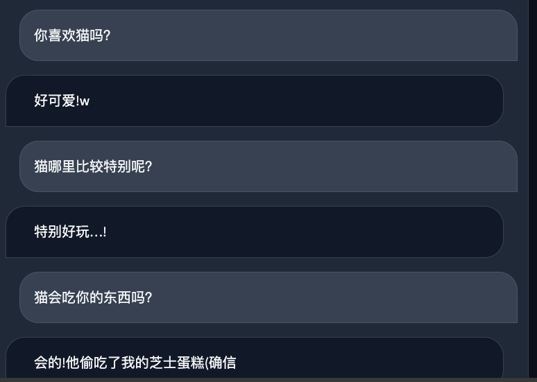

# Fujisaki

致力于创造一个属于你的不二咲千寻。项目处于初期阶段。

An ongoing (fast prototyping) project to create your own doppelgänger based on your Twitter archive and LoRA models.

## 这是什么项目？

在我十年前玩某个叫做《弹丸论破》的游戏的时候，有一位可爱的……后来她挂了，但是她以数字生命的形式帮助了未来的主人公冲出难关。如果我死了，还有人记得我吗？

该项目目前基于[ChatGLM+LoRa](https://github.com/mymusise/ChatGLM-Tuning/)，暂时致力于生成中文内容。也希望该项目能帮助到一些使用中文语料库进行prompt engineering以及内容生成的朋友。

Inspired by Fujisaki Chihiro (i.e., Alter Ego). I thought it would be a fun project, as I really cannot predict my death in the future, and I would like to see how my doppelgänger would react to the world. Thank to the super-strong LLM and LoRA to make it happen by allowing fine-tuning on small corpora.

## 项目基于什么原理

将你的Twitter存档目录解压缩放置在项目根目录下，即可自动处理。相关的程序会根据推文的内容、时间、引用、回复等信息，生成一个instruction风格的JSON数据集。然后，我们将该数据集用于某种中文语言模型的调参，生成新的推文，或启用给予上下文的对话。

目前项目的文字生成能力很优秀，问答一般，不过在推文涵盖的范围内能够识别一定的问题。目前还没有对话功能，需要更多的推文数据（threaded in-reply-to）才能实现。

优秀训练数据的生成是本项目的最终目的，目前的实现均在`prompt_basic.py`中，未来会逐步提升数据的质量，甚至会引入OpenAI生成更有价值的增广上下文。

## Demo:

HuggingFace Hub（慢一点的在线版本，可以直接运行）：[](https://huggingface.co/spaces/ljsabc/Fujisaki)

Colab演示（需要GPU）：[](https://colab.research.google.com/github/ljsabc/Fujisaki/blob/main/Fujisaki_GPU_Stream.ipynb)


 

相对于索引、问答目的的项目，该项目会更大程度上利用Sampling，即相似的上下文也会生成非常不一样的回答。希望这样的生成方法能够提供更高的互动性。

## To-do List

- [x] Modify the twitter-parser to output your twitter archive into a instruction dataset
- [x] Categorized in-reply-to and quoted tweets for better conditional generation
- [x] LoRA finetuning with multiple GPUs
- [x] Basic prompt engineering for original posts
- [x] Hyperparameter tuning (incl. LoRA rank, batch size, learning rate, etc.)
- [ ] Allow in-reply-to and quoted tweets to be downloaded, for now it can only generate random tweets/replies/quotes
- [ ] Advanced prompt engineering from OpenAI
- [x] Colab notebook for easy deployment (I believe this code can surely run on T4 as we are expecting much shortened tokens)
- [ ] Support other datasets (e.g. Reddit, Weibo, etc. Future plan)

## 环境与安装

推荐使用 `conda` 环境。安装依赖：

```pip install -r requirements.txt```

有些时候，你可能要安装cudatoolkit：

```conda install cudatoolkit=11.3```

可以帮助解决bitsandbytes检测不到CUDA runtime的问题。

## Data requirements

解压缩你的推文存档，放置在项目根目录下，即可自动处理。解压缩之后你应该能在项目根目录里面看到`Your archive.html`这个文件。然后，运行`twitter-parser.py`来解析你的推文存档，生成一个RLHF风格的JSON数据集。

同样的，你可以参考`tweets_sample.md`来生成你自己的数据集，或者等待项目更新。

## 训练

目前的模型基于[ChatGLM+LoRa](https://github.com/mymusise/ChatGLM-Tuning/)，与[Luotuo](https://github.com/LC1332/Chinese-alpaca-lora)的处理方式较为类似。

### 生成训练数据

首先使用

    python twitter-parser.py

来处理推文存档，稍许等待之后，你会在项目根目录下看到一个`tweets.md`的文件。这个文件包含了你的推文存档中的所有推文，以及相关的信息。为了保护你的隐私，请不要公开该文件。

生成相应的数据之后，我们需要进一步调用ChatGLM的`tokenizer`来生成对应的tokenized数据集。这一步需要一些时间。这个原始的版本会过度cache同一个generator导致数据无法更新，我改了一个单文件的版本。

    python ./tokenize_dataset_rows.py --json_path ./tweets.md --save_path tweets.tokens --max_seq_length 240

（可选）使用240个token是因为我的大部份推文，连同instruction一起，也不会超过240个token。如果你的推文较长，可以在生成jsonl之后调用`length.py`，根据输出的数据适当增加`max_seq_length`的数值。

    python3 ./cover_alpaca2jsonl.py --data_path tweets.md --save_path tweets.jsonl
    python length.py

### 可选项：根据回复推文生成更有互动性的数据集（Beta）

因为推文存档中的推文并不储存上下文信息，所以我们可以通过抓取回复推文来获得原始的上下文信息，来实现非常强的对话功能。这一步需要一些时间，但是只需要运行一次。
很不幸，抓取网站总是一个很痛苦的事情。你可能需要一个代理池，以及将`chromedriver`的二进制放在项目根目录中（需要你了解[selenium](https://selenium-python.readthedocs.io/)）。你可能还需要一台性能足够强的电脑，以便多线程抓取回复信息。如果你有这样的条件，可以调整`config.py`，将`PARSE_REPLIES = False`改为`PARSE_REPLIES = True`，然后运行`twitter-parser.py`。该部分已经写好。

该方法无法抓取已经被删除的你的，和别人的推文。抓取引用推文的功能也尚在检讨中。

### 训练

接下来便可调用`finetune.py`来进行模型训练。根据不同的GPU数量，你可以直接调用

    WORLD_SIZE=4 CUDA_VISIBLE_DEVICES=0,1,2,3 torchrun --nproc_per_node=4 \
    --master_port=1234 \
    finetune.py \
    --dataset_path tweets.tokens \
    --lora_rank 8 \
    --per_device_train_batch_size 2 \
    --gradient_accumulation_steps 1 \
    --num_train_epoch 1 \
    --save_steps 2000 \
    --save_total_limit 2 \
    --learning_rate 2e-4 \
    --fp16 \
    --remove_unused_columns false \
    --logging_steps 20 \
    --output_dir output \
    --ddp_find_unused_parameters false \
    --warmup_steps 50

进行多卡训练。如果多卡训练报错，

单卡训练：

    python finetune.py \
    --dataset_path tweets.tokens \
    --lora_rank 8 \
    --per_device_train_batch_size 2 \
    --gradient_accumulation_steps 4 \
    --num_train_epoch 1 \
    --save_steps 2000 \
    --save_total_limit 2 \
    --learning_rate 2e-4 \
    --fp16 \
    --remove_unused_columns false \
    --logging_steps 20 \
    --output_dir output \
    --warmup_steps 50 

项目的调参还在研究中，目前的参数和[ChatGLM+LoRa](https://github.com/mymusise/ChatGLM-Tuning/)很类似，不过可以根据GPU数量调节学习率。默认的学习率是`2e-4` （每8个sample，如果loss突增可能还要降一些），请根据batch size和显卡能力自行测试调节。LoRA的rank可以根据你希望的模型性能进行调节，默认的8是足够的，你也可以提升到12甚至更高，经过一定的测试`lora_rank`上到16结果会上升一个台阶，代价是稍微更长一点的训练和测试时间，但是不会多很多。

训练好的模型会保存在`output`文件夹下，你可以在`output/`中找到对应的模型文件。

## 预测（以及互动）

调用 `infer.py` 进行对话。你可以输入任何问题（但是目前没什么用），不过即便什么都不输入也可以生成一个很类似我的推文。

```python3 ./infer.py <path_to_model>```

可以在该文件中调节top-p，top-k和temerature，以便生成更多的样本。可以根据gradio demo的结果适当调节。

## Benchmark

在1张A100的配置下面，训练一个75,000条推文的数据集，在设定最大长度为240的情况下，每一个epoch需要3小时。训练大概需要2-3个epoch能够达成最佳状态。

## Credits

This project is based on the following projects:

    27182812/ChatGLM-chinese-insturct
    timhutton/twitter-archive-parser
    LC1332/Chinese-alpaca-lora (Donated❤️)

Inspired by the following projects:

    tloen/alpaca-lora
    HuggingFace: KBlueLeaf/guanaco-7B-lora-embed
    (potentially) twint-fork